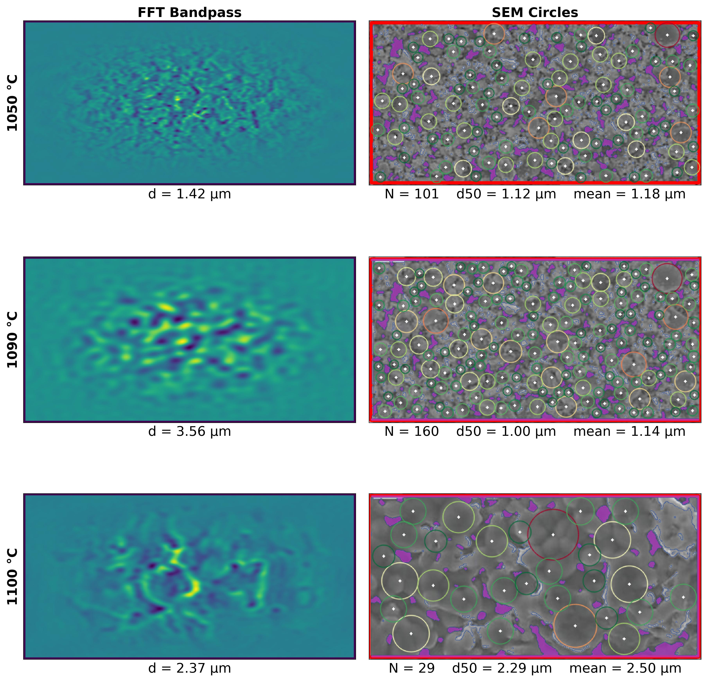

# SEM Grain Size Analysis Toolkit

This toolkit quantifies grain morphology in garnet-type solid-state electrolytes via SEM image analysis, combining FFT guidance with circle packing. It is calibrated to LLZO variants and requires parameter recalibration for other materials. Two scripts are provided: one for interactive pore segmentation comparison, another for temperature-dependent grain analysis (1050–1100 °C).

## Quick Start

```bash
git clone https://github.com/Llama-offical/Sem-grain-analyzer
cd sem-grain-analyzer
python pore_detection_demo.py
python grain_temperature_analyzer.py
```

Results saved to `outputs/`.

## Requirements

- Python 3.9+
- opencv-python, numpy, scipy, matplotlib

## Contributing

Developed as part of QXU6032 Advanced Ceramic and Glass Materials coursework (QMES, 2026). Methodological improvements are welcome via issues or pull requests.


